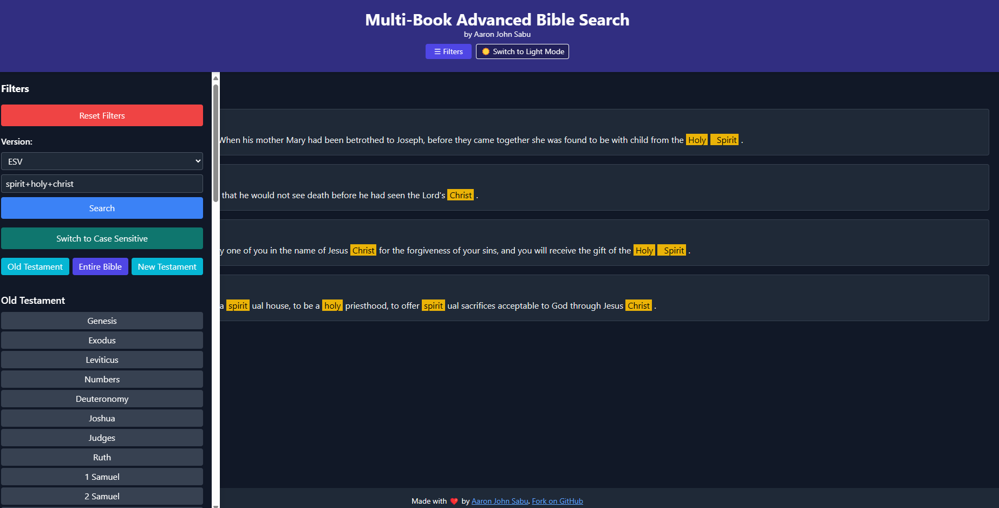

# The Multi-Book Advanced Bible Search (mBAB)

### Table of Contents

- [Introduction](#introduction)
- [For the Developer...](#for-the-developer)
  * [Useful Links](#useful-links)
  * [Installation of Necessary Packages](#installation-of-necessary-packages)
- [Contributors](#contributors)
- [Possible additions and modifications](#possible-additions-and-modifications)
- [License](#license)

### Introduction

This web application provides users the ability to search for a word sequence, either case-sensitive or case-insensitive, across a user-specified set of books of the Holy Bible.  
The application is currently hosted at [this platform](http://aaronjs.pythonanywhere.com/).

This project was originally developed using Flask and has now been **rebuilt using Django** for improved scalability and maintainability.



### For the Developer...

#### Useful Links

* [Django Official Documentation](https://docs.djangoproject.com/en/stable/)
* [Jinja Template and Syntax](https://jinja.palletsprojects.com/en/2.11.x/templates/) (still used for templates)
* [Python SQLite3 Documentation](https://docs.python.org/3/library/sqlite3.html)

#### Installation of Necessary Packages

Tested on **Python 3.11+**.

You can set up the project as follows:

```bash
# Install virtualenv if needed
sudo apt install python3-venv

# Create and activate a virtual environment
python3 -m venv venv
source venv/bin/activate

# Install dependencies
pip install -r requirements.txt

# Apply migrations (no models currently but necessary for Django)
python manage.py migrate

# Run the server
python manage.py runserver

#### Database Access

Presently I have removed databases from the corresponding directory in order to facilitate easier cloning of the repository. Feel free to download from or clone the repository on [Bible Databases](https://github.com/aaronjohnsabu1999/bible-databases)

***
### Contributors

Formatting suggestions have been provided by my dad, [Sabu John](https://www.facebook.com/sabu.john.104) and my mom, Jessy Sabu John, alongside several other users.  
Support for Flask has been provided extensively by [@hbhoyar](https://github.com/hbhoyar)  
The databases have been parsed from the SQL databases provided by [@scrollmapper](https://github.com/scrollmapper)

***
### Possible additions and modifications
##### You are welcome to contribute by adding to this list (issues) or improving it (pull requests):

* Make the web application fully responsive for mobile devices (smaller than 1920×1080 screens).
* Move controls into a collapsible sidebar for better usability.
* Add copyrighted versions such as NIV, NLT, and BSI Indian versions.
* Optionally introduce pagination for search results.
* Further subdivide the testaments by type (Law, History, Gospels, etc.).
* Extend search syntax beyond simple OR (,) and AND (+) (partially done).
* Improve UI/UX with more styling and theming.
* Enable optional user accounts to save search history.

***
### License

This project has been licensed under [](https://www.gnu.org/licenses/gpl-3.0.en.html)
